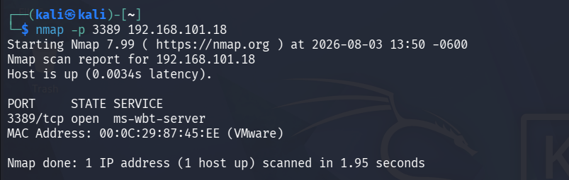

# Detección 1: Ataque de Fuerza Bruta contra RDP
 
## Resumen
 
Se simuló un ataque de fuerza bruta contra el servicio de Escritorio Remoto (RDP) de un endpoint Windows 10, utilizando Hydra desde Kali Linux. El ataque fue detectado y categorizado correctamente por Wazuh en tiempo real.
 
## Entorno
 
| Elemento | Detalle |
|---|---|
| Atacante | Kali Linux |
| Objetivo | Windows 10 Pro (agente Wazuh + Sysmon) |
| Servicio atacado | RDP (puerto 3389/TCP) |
| Herramienta | Hydra v9.7 |
| SIEM | Wazuh 4.9.2 |
 
## Reconocimiento previo
 
Antes del ataque, se confirmó que el puerto RDP estaba expuesto:
 
```bash
nmap -p 3389 <IP-objetivo>
```
 - nmap: Es el programa que se usa en Kali Linux para realizar el escaneo de redes.
 - -p 3389: -p es la opcion para decirle a Nmpa que escanee un solo puerto en este caso es el 3389.
 - <IP-objetivo>: Es la direccion IP de la maquina Windows que es nuestra victima.

Podemos obtener 3 respuestas: 

- open: Indica que el puerto esta escuchando y esperando conexiones.
- closed: El puerto esta cerrado y no esta un servicio escuchando ahi.
- filtered: No hay una respuesta clara por los que los paquetes se bloquean de manera silenciosa.

En un escenario real el atacante puede usar esta tecnica para poder escanear los puertos buscando una conexion y después realizar los ataques de fuerza bruta.

Resultado: puerto `3389/tcp open`



 
## Ejecución del ataque
 
Se preparó una lista de contraseñas de prueba (incluyendo variantes comunes y débiles) y se lanzó el ataque con:
 
```bash
hydra -l <usuario> -P passlist.txt -t 4 rdp://<IP-objetivo>
```
 
**Resultado del ataque:**
- 6 intentos de autenticación probados
- 1 credencial válida encontrada
- Tiempo total: ~2 segundos
```
[3389][rdp] host: <IP-objetivo>   login: <usuario>   password: [REDACTADO]
1 of 1 target successfully completed, 1 valid password found
```
 
> **Nota de seguridad:** la contraseña real se omite intencionalmente de esta documentación pública, siguiendo buenas prácticas de manejo de credenciales incluso en un entorno de laboratorio.
 
## Detección en Wazuh
 
El ataque generó múltiples alertas visibles en el dashboard, en la sección **Threat Hunting**, filtrando por el agente correspondiente.
 
**Resumen de alertas generadas:**
 
| Métrica | Valor |
|---|---|
| Total de eventos en la ventana de tiempo | 11 |
| Authentication failure | 11 |
| Grupos de reglas activados | `authentication_failed`, `windows_security` |
 
**Reglas específicas disparadas:**
- `Logon Failure - Unknown user or bad password` (nivel 5)
- `Successful Remote Logon Detected` (nivel 6)
- `Special privileges assigned to new logon` (nivel 3)

 
## Análisis
 
El patrón de eventos muestra la secuencia característica de un ataque de fuerza bruta:
1. Múltiples intentos fallidos de autenticación en un intervalo de tiempo muy corto (segundos)
2. Un logon exitoso inmediatamente después de los fallos
3. Asignación de privilegios a la nueva sesión iniciada
Este patrón —varios fallos seguidos de un éxito en cuestión de segundos, desde un único origen— es una señal de alerta típica que en un entorno real activaría una investigación inmediata por parte de un analista SOC, incluso sin conocer de antemano que se trataba de una prueba.
 
## Recomendaciones (perspectiva defensiva)
 
En un entorno de producción, este tipo de actividad debería mitigarse con:
- Bloqueo de cuenta tras N intentos fallidos (lockout policy)
- Autenticación multifactor (MFA) en servicios RDP expuestos
- Restricción de acceso RDP mediante VPN o Network Level Authentication (NLA)
- Alertas automáticas (no solo visibles en dashboard, sino con notificación activa) ante más de X fallos en Y minutos desde el mismo origen
## Herramientas utilizadas
 
`Hydra` `Nmap` `Wazuh` `Sysmon` `Windows Event Log`
 